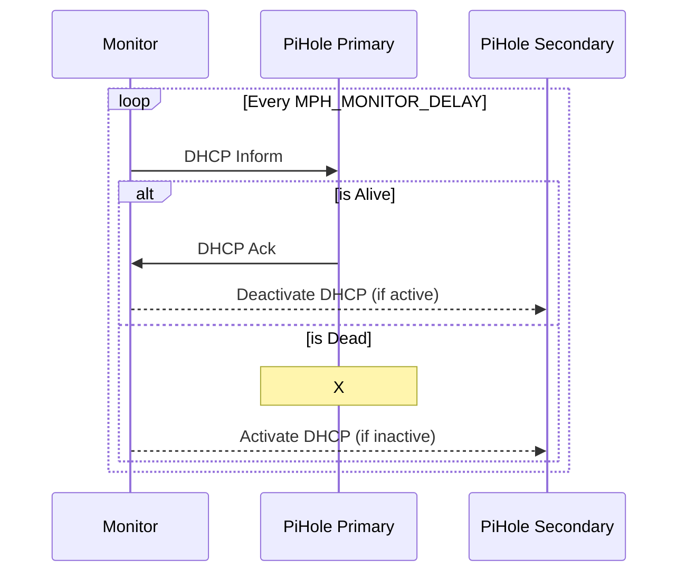
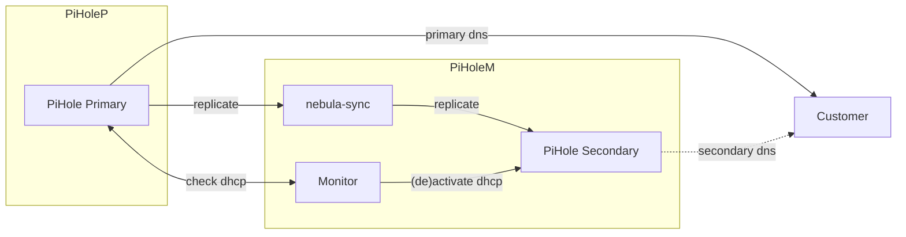

This simple project aim to manage a kind of *High Availability* for the DHCP between 2 PiHole.

This project is not a part of the official [Pi-hole](https://pi-hole.net/) project

# architecture

Both PiHole are always serving DNS and are both advertised as is, in the DHCP messages. Only *one* PiHole DHCP server is running at any time.

Monitor will simply check if dhcp is running on the *Primary PiHole*.
* if not, it will start dhcp on the *Secondary PiHole*
* if yes, it will stop dhcp on the *Secondary PiHole*



Replication of configuration from *Primary* to *Secondary* is done thru [nebula-sync](https://github.com/lovelaze/nebula-sync)



# usage

```bash
docker run -e MPH_PRIMARY="http://192.168.1.20:8086" \
           -e MPH_SECONDARY="http://192.168.1.80:8087|myReplicaPassword" \
           monitor_pihole
```

See [docker-compose.yml](docker-compose.yml) for a compose example.

# configuration variables

| name | description | default | exemple |
|------|-------------|---------|---------|
| **MPH_PRIMARY** | configuration for the primary dhcp. For now password is not needed for the primary. `http[s]://IP[:port][\|password]` | | http://192.168.1.20:8086 |
| **MPH_SECONDARY** | configuration for the secondary (backup) dhcp | | http://192.168.1.80:8087\|myReplicaPassword |
| MPH_MONITOR_DELAY | delay between 2 checks (in seconds) | 60 | 300 |
| MPH_VERBOSE | verbosity of the logs. 0 will show only dhcp failure, 2 is very verbose and **dump passwords** | 1 | 2 |
| MPH_SECONDARY_MAC | mac address associated with the secondary pihole ip address. | mac of the *default* interface | 0a:df:42:4b:50:ba |

# pihole & nebula-sync parameters
* pihole
  * *webserver.api.app_sudo* must be set to true on primary and secondary, or true on secondary and excluded from nebula-sync :/
  * dhcp server should have a configuration with @mac/@secondary_ip for the answer to DHCPINFORM to be right. However, tests shows that this seems to be not mandatory with dnsmasq
  * dhcpd should advertise the 2 dns servers. For this, activate *misc.etc_dnsmasq_d* and create a `99-second-dns.conf`, or add to *misc.dnsmasq_lines*
```
## add a second DNS to dhcp answer
# this need the pihole option dhcp.multiDNS to be unchecked !
dhcp-option=option:dns-server,192.168.1.20,192.168.1.80,192.168.1.20,192.168.1.80
# this is in conflict with pihole option dhcp.ipv6
dhcp-option=option6:dns-server,[2a01:xxxx:xxxx:xxxx::fec0:fe93],[fe80::211:32ff:fec0:fe93],[2a01:xxxx:xxxx:xxxx::d62c:dc],[fe80::4c9c:8bd5:d62c:dc]
```

* nebula
  * dhcp.active must not be synced : `SYNC_CONFIG_DHCP_EXCLUDE: active`
  * you might also want to disable the interface name sync : `SYNC_CONFIG_DNS_EXCLUDE: interface`

# caveats
* DHCP might be unavailable for up to MPH_MONITOR_DELAY seconds
* when Primary DHCP comes back online, there might be 2 DHCP servers active for up to MPH_MONITOR_DELAY seconds
* IP leases offered by the Secondary DHCP server (during Primary offline time) will not be known by the Primary


# todo
* ~~manage http & https in *_URL~~
* manage multiple replicas
* ~~use the same syntax as nebula for URL|password~~
* ~~what about RA in ICMPv6 & announced DNS~~
* copy leases from secondary to primary (teleport :/)

